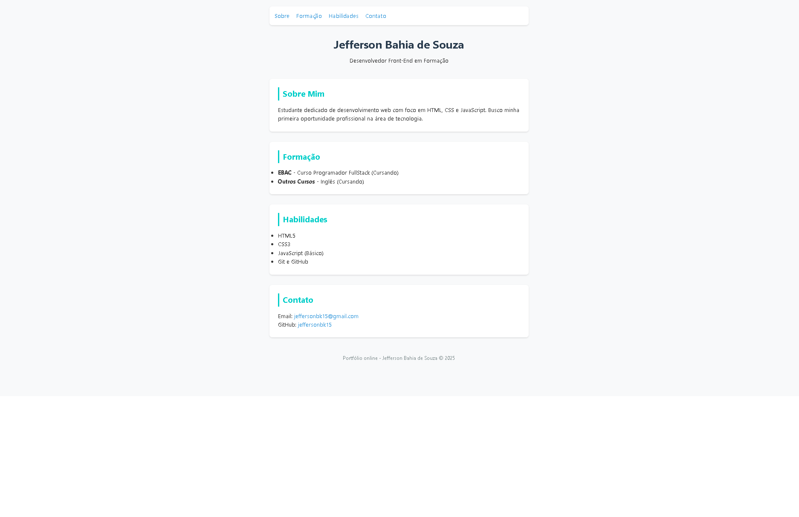

# 📄 Currículo Online Interativo  

Um currículo digital moderno com **dark mode**, efeitos visuais e formulário de contato.  

🔗 **Acesse aqui**: [https://jeffersonbk15.github.io/curriculo-online/](https://jeffersonbk15.github.io/curriculo-online/)  

## 🛠️ Tecnologias  
- HTML5  
- CSS3 (Flexbox, Grid, animações)  
- JavaScript (DOM manipulation, eventos)  

## ✨ Features  
- ✅ Alternar entre light/dark mode  
- ✅ Formulário de contato (simulado)  
- ✅ Layout responsivo  

## 📸 Preview
